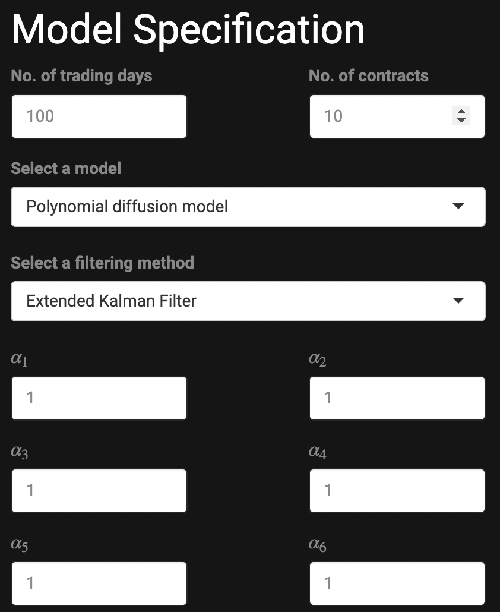
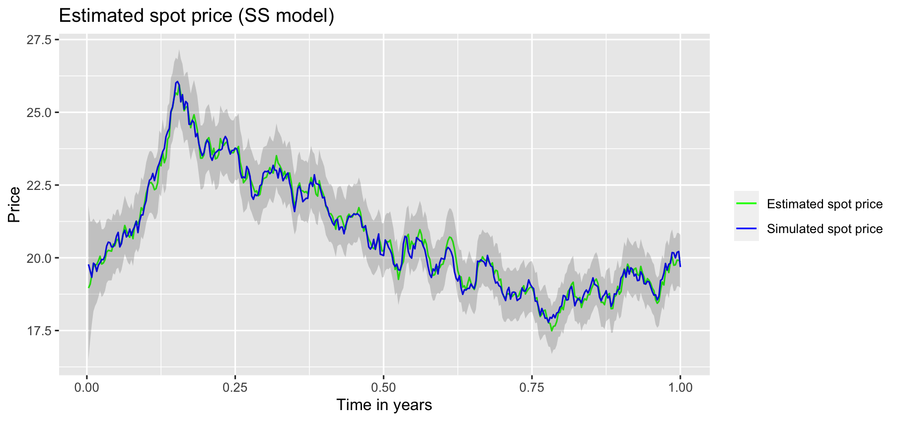
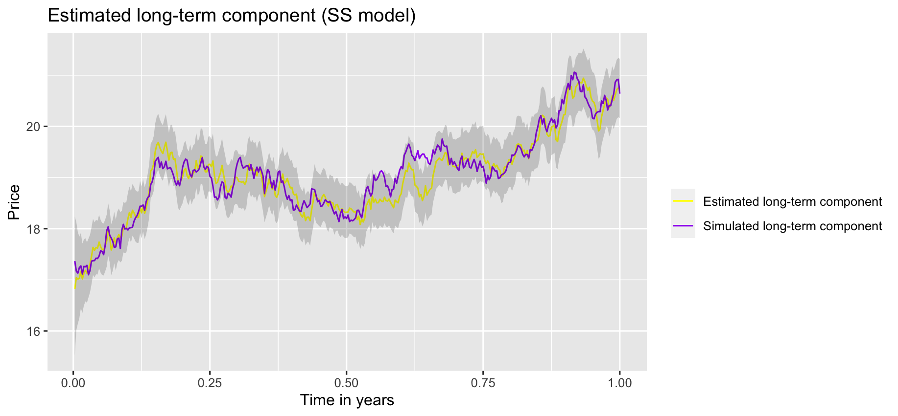
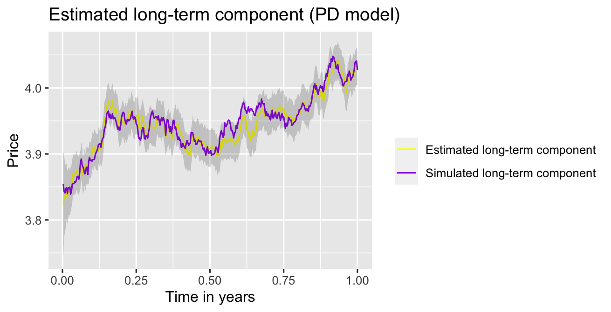
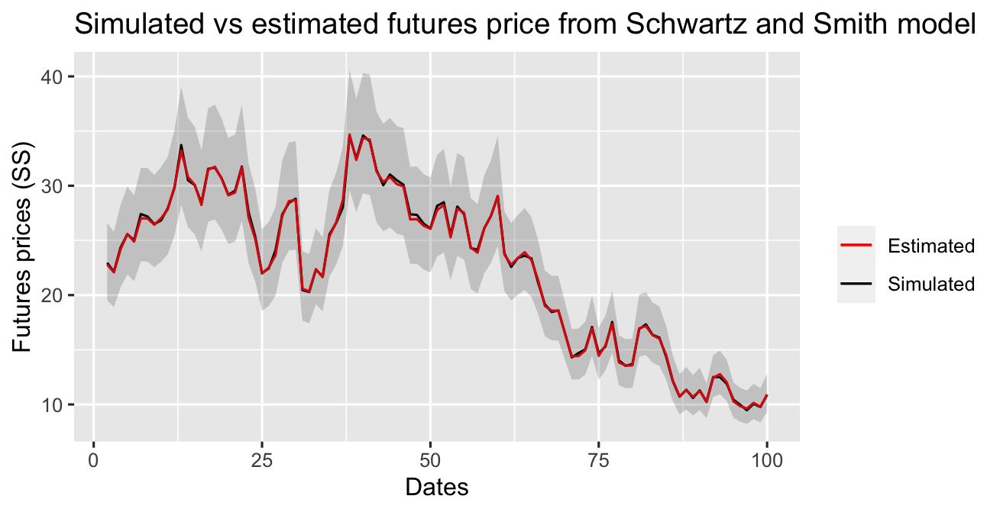

# Polynomial Diffusion Model Simulation and Estimation (V3.0.0)

## Introduction

This package allows users to simulate commodity futures data from two models,
Schwartz and Smith two-factor model (Schwartz & Smith, 2000) and polynomial
diffusion model (Filipovic & Larsson, 2016), through both GUI and R scripts.
Additionally, it gives state variables and contract estimations through Kalman
Filter (KF), Extended Kalman Filter (EKF) or Unscented Kalman Filter (UKF).

## Installation

PDSim can be accessed in two ways:

1. You can use PDSim on the Shiny server. This way, you don't need to have R
   installed on your computer. Just go to <https://peilunhe.shinyapps.io/pdsim/>
   and use it there.
2. Additionally, you can download and run PDSim locally, by running the
   following R code:

   ```r
   # install.packages("devtools") # uncomment if you do not have devtools installed
   devtools::install_github("peilun-he/PDSim", build_vignettes = TRUE)
   PDSim::run_app()
   ```

A tutorial of how to use this app is available by running the following code
and select "PDSim app tutorial":

```r
browseVignettes("PDSim")
```

### Docker Installation
For those users who do not want to pollute your system, we also provide Docker
installation. Please follow these steps:
1. Make sure you have Docker installed on you machine. Then download all files.
2. From your terminal, in the directory where the Dockerfile is located, run:

   ```
   docker build -t pdsim .
   ```

   to build the image. For Macbook M1/M2/M3 chip users, if you have a
   "no match for platform in manifest" error for building the image,
   please run this instead:
   
   ```
   docker build -t pdsim . --platform=linux/amd64 --no-cache
   ```
3. To start a container, run

   ```
   docker run -p 8787:8787 --name pdsim1  pdsim
   ```
   
4. Open browser and go to `localhost:8787`. The default username is `rstudio` and
   the random password is available in terminal.  
5. Finally, you can use PDSim by running

   ```r
   PDSim::run_app()
   ```
   
   in the opened R Studio server. 

## How to Use PDSim (GUI)

The graphical user interface (GUI) is a easy way for everyone to use PDSim package,
even though you have no knowledge of programming. Just enter all necessary parameters,
it will simulate data, and provide well-designed interactive visualisations. Currently,
PDSim can simulate data from two models, Schwartz and Smith two-factor model (Schwartz
& Smith, 2000), and polynomial diffusion model (Filipovic & Larsson, 2016). In this
section, we will explain how to use GUI to simulate data.
A detailed description of two models are available in
[Model Description](#model-description).

### PDSim (GUI) for Schwartz-Smith Model

Firstly, we establish certain global configurations, such as defining
the number of observations (trading days) and contracts.
Furthermore, we make a selection regarding the model from which
the simulated data is generated.


For Schwartz-Smith model (Schwartz & Smith, 2000), we assume the logarithm of spot
price $S_t$, is the sum of two hidden factors:
$$\log{(S_t)} = \chi_t + \xi_t, $$
where $\chi_t$ represent the short term fluctuation and $\xi_t$ is the long term
equilibrium price level. We assume both $\chi_t$ and $\xi_t$ follow a risk-neutral
mean-reverting process:
$$d\chi_t = (- \kappa \chi_t - \lambda_{\chi}) dt +
\sigma_{\chi} dW_t^{\chi*}, $$
$$d\xi_t = (\mu_{\xi} - \gamma \xi_t - \lambda_{\xi}) dt +
\sigma_{\xi} dW_t^{\xi*}. $$
$\kappa, \gamma \in \mathbb{R}^+$ are called the speed of mean-reversion parameters,
which controls how fast those two latent factors converge to their mean levels. Most
of experiments suggest that $\kappa, \gamma \in (0, 3]$. In addition, to avoid
a subtle parameter identification error (due to a latent parameter identification
problem, see [Tests](#tests) section), we recommend
that users limit $\kappa$ to be greater than $\gamma$, which means that the short-term
fluctuation factor converges faster than the long-term factor. $\mu_{\xi} \in \mathbb{R}$
is the mean level of the long-term factor $\xi_t$. Here we assume that the short-term
factor converges to 0. $\sigma_{\chi}, \sigma_{\xi} \in \mathbb{R}^+$ are volatilities,
which represent the degree of variation of a price series over time. $\lambda_{\chi},
\lambda_{\xi} \in \mathbb{R}$ are risk premiums. We price commodity under arbitrage-free
assumption: "the price of the derivative is set at the same level as
the value of the replicating portfolio, so that no trader can make
a risk-free profit by buying one and selling the other.
If any arbitrage opportunities do arise, they quickly disappear as
traders taking advantage of the arbitrage push the derivative’s
price until it equals the value of replicating portfolios"
([Risk.Net](https://www.risk.net/definition/no-arbitrage-pricing), n.d., para. 2).
In reality, we need to introduce the mean terms corrections - which are
$\lambda_{\chi}$ and $\lambda_{\xi}$. $W_t^{\chi*}$ and $W_t^{\xi*}$ are correlated
standard Brownian Motions with correlation coefficient $\rho$. In discrete time,
these processes are discretised to Gaussian noises. All of them are parameters need
to be specified. Additionally, for simplicity, we assume the standard errors
$\sigma_i, i = 1, \dots, m$ for futures contracts are evenly spaced,
i.e., $\sigma_1 - \sigma_2 = \sigma_2 - \sigma_3 = \dots = \sigma_{m-1} - \sigma_m$.
If users don't know the value of a parameter, we recommend using the default value.

If users have special needs for the standard errors, please use R script.


Finally, all the simulated data are downloadable. Please click `Download prices`
and `Download maturities` buttons to download futures price and maturities data.
Please note, even though Schwartz and Smith (2000) models the logarithm of spot
price, **all data downloaded or plotted are real price, they have been exponentiated**.
The other button `Generate new data` is designed for users who want to simulate
multiple realisations from the same set of parameters. Once clicking it,
PDSim will get another set of random noises, so the futures price
will change as well. This button is not compulsory if users only
need one realisations. The data will updated automatically when
you change any parameters.


### PDSim (GUI) for Polynomial Diffusion Model

The procedure for simulating data from the polynomial diffusion model
(Filipovic & Larsson, 2016) closely resembles that of the Schwartz and
Smith model (Schwartz & Smith, 2000). Nevertheless, it involves the
specification of additional parameters.

Firstly, let's look at the difference between these two models. Both the
polynomial diffusion model (Filipovic & Larsson, 2016) and the Schwartz
and Smith model (Schwartz & Smith, 2000) assume that the spot price $S_t$
is influenced by two latent factors, $\chi_t$ and $\xi_t$. However,
the Schwartz and Smith model (Schwartz & Smith, 2000) assumes that the
logarithm of $S_t$ is the sum of two factors, whereas the polynomial
diffusion model (Filipovic & Larsson, 2016) posits that $S_t$ takes on
a polynomial form. Currently, PDSim GUI can only deal with polynomials
with degree 2, i.e.,
$$S_t = \alpha_1 + \alpha_2 \chi_t + \alpha_3 \xi_t + \alpha_4 \chi_t^2 +
\alpha_5 \chi_t \xi_t + \alpha_6 \xi_t^2.$$
$\alpha_i, i = 1, \dots, 6$ are extra parameters to the polynomial diffusion
model (Filipovic & Larsson, 2016). If users want to specify a polynomial with
degree 1, just set $\alpha_4 = \alpha_5 = \alpha_6 = 0$. Additionally,
users are required to specify one non-linear filtering methods,
Extended Kalman Filter (EKF) or Unscented Kalman Filter (UKF).



All other procedures are the same as the Schwartz and Smith model
(Schwartz & Smith, 2000).

### Some Other Hints

- Once users enter all parameters, the data will be generated automatically.
  Users do NOT need to click any buttons. However, if users wish to generate more
  realisations under the same set of parameters, please click the
  'Generate new data' button.
- The seed to generate random numbers is fixed, i.e., for the same set of parameters,
  users will get exactly the same data every time they use PDSim.
- Futures prices in all tables / plots are REAL prices (NOT the logarithm),
  no matter which model is used.
- The 95% confidence interval is shown as a grey ribbon on each plot.
- Because of the limitation of filtering methods, the standard error of the
  estimated futures price on the first day is extremely large. All plots of
  contracts estimation start from the second day.

## How to Use PDSim (R Script)

The GUI should be suffice. However, if you want to have more control of
the data simulated, you can use R script. In this section, we will discuss
how to use exported functions from this package to simulate data,
as well as how to use Kalman Filter (KF), Extended Kalman Filter (EKF)
and Unscented Kalman Filter (UKF) to estimate the hidden state variables.

Firstly, load the package:

```r
library(PDSim)
```

If you don't have PDSim installed, please refer [Installation](#installation).

Next, we specify the necessary global setups:

```r
n_obs <- 100 # number of observations
n_contract <- 10 # number of contracts
dt <- 1/360  # interval between two consecutive time points,
# where 1/360 represents daily data
```

### PDSim (R Script) for Schwartz-Smith Model

Next, we specify parameters. For the Schwartz-Smith model (Schwartz & Smith, 2000),
there is no model coefficients.

```r
par <- c(0.5, 0.3, 1, 1.5, 1.3, -0.3, 0.5, 0.3,
         seq(from = 0.1, to = 0.01, length.out = n_contract)) # set of parameters
x0 <- c(0, 1/0.3) # initial values of state variables
n_coe <- 0 # number of model coefficient
```

The set of parameters are in the order of: $\kappa, \gamma, \mu_{\xi},
\sigma_{\chi}, \sigma_{\xi}, \rho, \lambda_{\chi}, \lambda_{\xi}$.
The long sequence is the standard errors of measurement equation.
We assume all futures curves are uncorrelated and standard errors
are evenly decreasing. You can have your own assumptions on standard
errors, but the independence of curves must be hold.

Then, we specify the measurement and state equations. You can use the
exported functions `measurement_linear` and `state_linear` directly,
or write you own functions.

```r
# state equation
func_f <- function(xt, par) state_linear(xt, par, dt)
# measurement equation
func_g <- function(xt, par, mats) measurement_linear(xt, par, mats)
```

Finally, we can simulate the futures price, time to maturity,
and hidden state variables:

```r
dat <- simulate_data(par, x0, n_obs, n_contract,
                     func_f, func_g, n_coe, "Gaussian", 1234)
log_price <- dat$yt # logarithm of futures price
mats <- dat$mats # time to maturity
xt <- dat$xt # state variables
```

Please note, `measurement_linear` returns the logarithm of futures price
(which is required by the Schwartz and Smith model), so the data simulated
is also the logarithm.

Additionally, we can estimate the hidden state variables through
Kalman Filter (KF):

```r
# delivery_time is unnecessary as we don't have seasonality
est <- KF(par = c(par, x0), yt = log_price, mats = mats,
          delivery_time = 0, dt = dt, smoothing = FALSE,
          seasonality = "None")
```

### PDSim (R Script) for Polynomial Diffusion Model

For the polynomial diffusion model (Filipovic & Larsson, 2016),
we have to specify both parameters and model coefficients:

```r
par <- c(0.5, 0.3, 1, 1.5, 1.3, -0.3, 0.5, 0.3,
         seq(from = 0.1, to = 0.01, length.out = n_contract)) # set of parameters
x0 <- c(0, 1/0.3) # initial values of state variables
n_coe <- 6 # number of model coefficient
par_coe <- c(1, 1, 1, 1, 1, 1) # model coefficients
```

Currently, PDSim can deal with a polynomial with order 2,
i.e., 6 model coefficients.

Then, we specify the measurement and state equations. Again,
you can use the exported functions `state_linear` and
`measurement_polynomial`.

```r
# state equation
func_f <- function(xt, par) state_linear(xt, par, dt)
# measurement equation
func_g <- function(xt, par, mats) measurement_polynomial(xt, par, mats, 2, n_coe)
```

Finally, simulate the data:

```r
dat <- simulate_data(c(par, par_coe), x0, n_obs, n_contract,
                     func_f, func_g, n_coe, "Gaussian", 1234)
price <- dat$yt # measurement_polynomial function returns the futures price
mats <- dat$mats # time to maturity
xt <- dat$xt # state variables
```

`measurement_polynomial` returns the actual price,
rather than the logarithm.

We can also estimate the hidden state variables through
Extended Kalman Filter (EKF) or Unscented Kalman Filter (UKF):

```r
est_EKF <- EKF(c(par, par_coe, x0), price, mats, func_f, func_g, dt, n_coe, "Gaussian")
est_UKF <- UKF(c(par, par_coe, x0), price, mats, func_f, func_g, dt, n_coe, "Gaussian")
```

## Model Description

### Schwartz-Smith Model

The spot price $S_t$ is modelled as
$$\log(S_t) = \chi_t + \xi_t,$$
where $\chi_t$ represents the short-term fluctuation and
$\xi_t$ is the long-term equilibrium price level.
We assume both $\chi_t$ and $\xi_t$ follow an
Ornstein–Uhlenbeck process
$$d\chi_t = - \kappa \chi_t dt + \sigma_{\chi} dW_t^{\chi}$$
$$d\xi_t = (\mu_{\xi} - \gamma \xi_t) dt + \sigma_{\xi} dW_t^{\xi}$$
for real processes and
$$d\chi_t = (- \kappa \chi_t - \lambda_{\chi}) dt + \sigma_{\chi} dW_t^{\chi*}$$
$$d\xi_t = (\mu_{\xi} - \gamma \xi_t - \lambda_{\xi}) dt + \sigma_{\xi} dW_t^{\xi*}$$
for risk-neutral processes.
$\kappa, \gamma \in \mathbb{R}^+$ are speed of mean-reversion parameters;
$\mu_{\xi} \in \mathbb{R}$ is the mean level of the long-term factor;
$\sigma_{\chi}, \sigma_{\xi} \in \mathbb{R}^+$ are volatilities;
$\lambda_{\chi}, \lambda_{\xi} \in \mathbb{R}$ are risk premiums;
$W_t^{\chi*}$ and $W_t^{\xi*}$ are correlated standard Brownian Motions
with correlation coefficient $\rho $.
In the original Schwartz-Smith model (Schwartz & Smith, 2000),
the parameter $\gamma$ is set to zero. However, in our extended model,
we introduce the flexibility for this mean-reversion parameter associated
with the long-term factor to take on non-zero values. Arbitrage-free pricing
for the extended model has found application in agricultural commodity futures
(Sørensen, 2002) and crude oil futures (Ames et al., 2020; Cortazar et al.,
2019; Cortazar & Naranjo 2006).

Theoretically, there are few constraints on parameters, apart from those outlined
above, where $\kappa, \gamma, \sigma_{\chi},
\sigma_{\xi} \in \mathbb{R}^+$ and $\rho \in [-1, 1]$ (as $\rho$ represents the
correlation coefficient). Additionally, we recommend users to impose the constraint
$\kappa > \gamma$. Although users won't encounter errors if this constraint is
violated, it proves beneficial in resolving the latent parameter identification
problem. Without this constraint, there is a risk of misidentification, where the
short-term factor $\chi_t$ might be mistaken for the long-term factor $\xi_t$,
and vice versa. The recommended constraint helps prevent such misinterpretations.

Under the arbitrage-free assumption, the futures price $F_{t,T}$ at
current time $t$ with maturity time $T$ must be equal to the
expected value of spot price at maturity time, i.e.,
$$\log(F_{t,T}) = \log(\mathbb{E}^\*(S_T \mathcal{F}_t | \mathcal{F}_t)),$$

where $F_t$ is the filtration until time $t$. In discrete time,
we have the linear Gaussian state-space model:
$$x_t = c + E x_{t-1} + w_t,$$
$$y_t = d_t + F_t x_t + v_t,$$
where

$$
x_t = \left[ \begin{matrix}
\chi_t\\
\xi_t
\end{matrix} \right],
c = \left[ \begin{matrix} 0\\
\frac{\mu_{\xi}}{\gamma} (1 - e^{-\gamma \Delta t}) \end{matrix} \right],
E = \left[ \begin{matrix} e^{-\kappa \Delta t} & 0\\
0 & e^{-\gamma \Delta t} \end{matrix} \right],
F_t = \left[ \begin{matrix} e^{-\kappa (T_1 - t)}, \dots, e^{-\kappa (T_m - t)} \\
e^{-\gamma (T_1 - t)}, \dots, e^{-\gamma (T_m - t)} \end{matrix} \right]^\top,
$$

$$
y_t = \left( \log{(F_{t,T_1})}, \dots, \log{(F_{t,T_m})} \right)^\top,
d_t = \left( A(T_1 - t), \dots, A(T_m - t) \right)^\top,
$$

and $m$ is the number of contracts. The function $A(\cdot)$ is given by
$$A(t) = -\frac{\lambda_{\chi}}{\kappa}(1 - e^{-\kappa t}) +
\frac{\mu_{\xi} - \lambda_{\xi}}{\gamma}(1 - e^{-\gamma t}) +
\frac{1}{2} \left(\frac{1 - e^{-2\kappa t}}{2\kappa}\sigma_{\chi}^2 +
\frac{1 - e^{-2\gamma t}}{2\gamma}\sigma_{\xi}^2 +
2\frac{1 - e^{-(\kappa + \gamma)t}}{\kappa + \gamma}
\sigma_{\chi}\sigma_{\xi}\rho \right).$$

$w_t$ and $v_t$ are multivariate Gaussian noises with
mean 0 and covariance matrix $\Sigma_w$ and $\Sigma_v$
respectively, where

$$
\Sigma_w = \left[ \begin{matrix}
\frac{1 - e^{-2\kappa \Delta t}}{2\kappa}\sigma_{\chi}^2 &
\frac{1 - e^{-(\kappa + \gamma) \Delta t}}{\kappa + \gamma}
\sigma_{\chi}\sigma_{\xi}\rho \\
\frac{1 - e^{-(\kappa + \gamma) \Delta t}}{\kappa + \gamma}
\sigma_{\chi}\sigma_{\xi}\rho &
\frac{1 - e^{-2\gamma \Delta t}}{2\gamma}\sigma_{\xi}^2
\end{matrix} \right],
$$

and we assume $\Sigma_v$ is diagonal, i.e.,

$$
\Sigma_v = \left[ \begin{matrix}
\sigma_1^2 & 0 & \dots & 0\\
0 & \sigma_2^2 & \dots & 0 \\
\vdots & \vdots & \ddots & \vdots \\
0 & 0 & \dots & \sigma_m^2
\end{matrix} \right].
$$

Moreover, we assume $\sigma_1, \dots \sigma_m$ are evenly
spaced, i.e., $\sigma_1 - \sigma_2 = \sigma_2 - \sigma_3 =
\dots = \sigma_{m-1} - \sigma_m$.

### Polynomial Diffusion Model

Under the polynomial diffusion framework, the spot price $S_t$ is expressed as
a polynomial function of the hidden state vector $x_t$ (with components $\chi_t$
and $\xi_t$):
$$S_t = p_n(x_t) = \alpha_1 + \alpha_2 \chi_t + \alpha_3 \xi_t +
\alpha_4 \chi_t^2 + \alpha_5 \chi_t \xi_t + \alpha_6 \xi_t^2. $$
In this context, we assume that the polynomial $p_n(x_t)$ has a degree of 2
(or 1 if $\alpha_4 = \alpha_5 = \alpha_6 = 0$). However, it is worth noting that
all the theorems presented here are applicable even for polynomials of higher
degrees. Additionally, similar to the Schwartz and Smith model, we assume that
$\chi_t$ and $\xi_t$ follow an Ornstein–Uhlenbeck process
$$d\chi_t = - \kappa \chi_t dt + \sigma_{\chi} dW_t^{\chi}$$
$$d\xi_t = (\mu_{\xi} - \gamma \xi_t) dt + \sigma_{\xi} dW_t^{\xi}$$
for real processes and
$$d\chi_t = (- \kappa \chi_t - \lambda_{\chi}) dt + \sigma_{\chi} dW_t^{\chi*}$$
$$d\xi_t = (\mu_{\xi} - \gamma \xi_t - \lambda_{\xi}) dt + \sigma_{\xi} dW_t^{\xi*}$$
for risk-neutral processes.

Now, consider any processes that follow the stochastic differential equation
$$dX_t = b(X_t)dt + \sigma(X_t)dW_t,$$
where $W_t$ is a $d$-dimensional standard Brownian Motion and map $\sigma:
\mathbb{R}^d \to \mathbb{R}^{d \times d}$ is continuous. Define
$a := \sigma \sigma^\top$. For maps $a: \mathbb{R}^d \to \mathbb{S}^{d}$
and $b: \mathbb{R}^d \to \mathbb{R}^d$, suppose we have $a_{ij} \in Pol_2$
and $b_i \in Pol_1$. $\mathbb{S}^d$ is the set of all real symmetric $d \times d$
matrices and $Pol_n$ is the set of all polynomials of degree at most $n$.
Then the solution of the SDE is a polynomial diffusion. Moreover, we define the
generator $\mathcal{G}$ associated to the polynomial diffusion $X_t$ as
$$\mathcal{G}f(x) = \frac{1}{2} Tr\left( a(x) \nabla^2 f(x)\right) +
b(x)^\top \nabla f(x)$$
for $x \in \mathbb{R}^d$ and any $C^2$ function $f$. Let $N$ be the dimension
of $Pol_n$, and $H: \mathbb{R}^d \to \mathbb{R}^N$ be a function whose components
form a basis of $Pol_n$. Then for any $p \in Pol_n$, there exists a unique vector
$\vec{p} \in \mathbb{R}^N$ such that
$$p(x) = H(x)^\top \vec{p}$$
and $\vec{p}$ is the coordinate representation of $p(x)$. Moreover, there exists
a unique matrix representation $G \in \mathbb{R}^{N \times N}$ of the generator
$\mathcal{G}$, such that $G \vec{p}$ is the coordinate vector of $\mathcal{G} p$.
So we have
$$\mathcal{G} p(x) = H(x)^\top G \vec{p}.$$

**Theorem 1:** Let $p(x) \in Pol_n$ be a polynomial with coordinate representation
$\vec{p} \in \mathbb{R}^N$, $G \in \mathbb{R}^{N \times N}$ be a matrix representation
of generator $\mathcal{G}$, and $X_t \in \mathbb{R}^d$ satisfies the SDE.
Then for $0 \le t \le T$, we have
$$\mathbb{E} \left[ p(X_T) | \mathcal{F}_t \right] = H(X_t)^\top e^{(T-t)G} \vec{p},$$
where $\mathcal{F}_t$ represents all information available until time $t$.

Obviously, the hidden state vector $x_t$ satisfies the SDE with

$$
b(x_t) = \left[ \begin{matrix}
-\kappa \chi_t - \lambda_{\chi} \\
\mu_{\xi} - \gamma \xi_t - \lambda_{\xi}
\end{matrix} \right],
\sigma(x_t) = \left[ \begin{matrix}
\sigma_{\chi} & 0 \\
0 & \sigma_{\xi}
\end{matrix} \right],
a(x_t) = \sigma(x_t) \sigma(x_t)^\top = \left[ \begin{matrix}
\sigma_{\chi}^2 & 0 \\
0 & \sigma_{\xi}^2
\end{matrix} \right].
$$

The basis
$$H(x_t) = (1, \chi_t, \xi_t, \chi_t^2, \chi_t \xi_t, \xi_t^2)^\top$$
has a dimension $N = 6$. The coordinate representation is
$$\vec{p} = (\alpha_1, \alpha_2, \alpha_3, \alpha_4, \alpha_5, \alpha_6)^\top.$$
By applying $\mathcal{G}$ to each element of $H(x_t)$, we get the matrix representation

$$
G = \left[ \begin{matrix}
0 & -\lambda_{\chi} & \mu_{\xi} - \lambda_{\xi} &
\sigma_{\chi}^2 & 0 & \sigma_{\xi}^2 \\
0 & -\kappa & 0 & -2 \lambda_{\chi} & \mu_{\xi} - \lambda_{\xi} & 0 \\
0 & 0 & -\gamma & 0 & -\lambda_{\chi} & 2\mu_{\xi} - 2\lambda_{\xi} \\
0 & 0 & 0 & -2\kappa & 0 & 0 \\
0 & 0 & 0 & 0 & -\kappa - \gamma & 0 \\
0 & 0 & 0 & 0 & 0 & -2\gamma
\end{matrix} \right].
$$

Then, by Theorem 1, the futures price $F_{t,T}$ is given by
$$F_{t,T} = \mathbb{E}^*(S_T | \mathcal{F}_t) = H(x_t)^\top e^{(T-t)G} \vec{p}.$$

Therefore, we have the non-linear state-space model
$$x_t = c + E x_{t-1} + w_t,$$
$$y_t = H(x_t)^\top e^{(T-t)G} \vec{p} + v_t.$$

## Tests

In this section, we explore various tests that users can employ to
validate the full functionality of PDSim. Firstly, we introduce unit tests,
which are accessible within the PDSim application. Next, we present
replications of Schwartz and Smith's results, followed by individual tests
for each model utilizing an R script. Finally, we offer real-world
data applications to demonstrate the accuracy of PDSim.

### Unit tests

Users can undergo a unit test under the "Unit Tests" navigaion bar of PDSim
to ensure that all functionalities of PDSim are operating correctly. This
test sequence entails several key steps: initially, users define the desired
number of trajectories and relevant parameters. Subsequently, PDSim executes
simulations based on these specifications, generating simulated trajectories.
Upon simulation completion, we employ KF/EKF/UKF methodologies to estimate
trajectories alongside their 95% confidence intervals. The coverage rate,
indicating the proportion of trajectories where over 95% of points fall
within the confidence interval, is then computed. Given our knowledge of
the true parameter values, a high coverage rate, ideally close to 100%,
is expected.

Users receive detailed feedback under the 'Results' tab panel. Moreover,
PDSim generates two plots: one illustrating the trajectory with the highest
coverage rate and another depicting the trajectory with the lowest coverage
rate. Additionally, a table presents the coverage rate for each trajectory.

It's important to note a few considerations: firstly, for simplicity,
only a single contract is simulated, regardless of the number specified by
the user. Secondly, if the coverage rate falls below 99%, users are advised
to either increase the number of trajectories or adjust parameters.
Lastly, users are informed that extensive simulations may lead to longer
processing times; for instance, generating results for 100 trajectories
typically requires around 15 seconds on a standard laptop.

### Replicating Schwartz and Smith's Results

In this section, we reproduce Figure 1 and Figure 4 from Schwartz and
Smith's paper using our own implementation.

The figure below displays the replication of Figure 1 from Schwartz and
Smith's paper. This figure illustrates the mean simulated spot price
($\exp{(\chi_t+\xi_t)}$) and the mean long-term component ($\exp{(\xi)}$),
alongside their respective 10th and 90th percentiles. Utilizing identical
parameters, our results match those of Schwartz and Smith. As time
approaches infinity, the short-term factor tends towards 0, leading the
long-term factor to converge towards the spot price.


Below is a plot depicting the polynomial diffusion model. In this model,
the spot price is represented as $S_t = \alpha_1 + \alpha_2 \chi_t +
\alpha_3 \xi_t + \alpha_4 \chi_t^2 + \alpha_5 \chi_t \xi_t +
\alpha_6 \xi_t^2$. Meanwhile, the long-term component is expressed as
$\alpha_1 + \alpha_3 \xi_t + \alpha_6 \xi_t^2$. 


Below are two plots replicating Figure 4 from Schwartz and Smith's
paper. Since we lack access to their original data, we simulate
trajectories using their estimated parameters instead. The first plot
illustrates the simulated spot price alongside the estimated spot price,
both within the 95% confidence interval of estimation. The second plot
displays the estimated long-term component, also within the
95% confidence interval.





Below are two plots presenting the estimated spot price and long-term
component for the polynomial diffusion model. Each point falls within
the 95% confidence interval, providing a comprehensive visualization
of the model's estimations.




### Tests for Schwartz and Smith Model

Users can utilise the following codes snippets to evaluate the performance of
simulation and estimation for the Schwartz and Smith model:

```r
library(ggplot2)
n_obs <- 100 # number of observations
n_contract <- 10 # number of contracts
dt <- 1/360  # interval between two consecutive time points,
# where 1/360 represents daily data
seed <- 1234 # seed for random number

# In the order of: kappa, gamma, mu, sigma_chi, sigma_xi,
# rho, lambda_chi, lambda_xi, measurement errors
par <- c(1.5, 1.3, 1, 1.5, 1.3, -0.3, 0.5, 0.3,
         seq(from = 0.01, to = 0.001, length.out = n_contract)) # set of parameters
x0 <- c(0, 1/0.3) # initial values of state variables
n_coe <- 0 # number of model coefficient

# state equation
func_f <- function(xt, par) state_linear(xt, par, dt)
# measurement equation
func_g <- function(xt, par, mats) measurement_linear(xt, par, mats)

sim <- simulate_data(par, x0, n_obs, n_contract,
                     func_f, func_g, n_coe, "Gaussian", seed)
log_price <- sim$yt # logarithm of futures price
mats <- sim$mats # time to maturity
xt <- sim$xt # state variables

# delivery_time is unnecessary as we don't have seasonality
est <- KF(par = c(par, x0), yt = log_price, mats = mats,
          delivery_time = 0, dt = dt, smoothing = FALSE,
          seasonality = "None")

yt_hat <- data.frame(exp(func_g(t(est$xt_filter), par, mats)$y))

# rmse should be:
# 0.1979, 0.1502, 0.1198, 0.0799, 0.0526
# 0.0422, 0.0283, 0.0195, 0.0102, 0.0031
rmse <- sqrt( colMeans((exp(sim$yt) - yt_hat)^2) )
round(rmse, 4)
```

The code should execute without encountering any errors, and the resulting
RMSE should match the specified values precisely. Moreover, users have the
option to examine the plot of simulated and estimated (1st available)
contracts using these codes:

```r
cov_y <- est$cov_y # covariance matrix

contract <- 1 # 1st available contract
CI_lower <- qlnorm(0.025,
                   meanlog = log(yt_hat[, contract]),
                   sdlog = sqrt(cov_y[contract, contract, ]))
CI_upper <- qlnorm(0.975,
                   meanlog = log(yt_hat[, contract]),
                   sdlog = sqrt(cov_y[contract, contract, ]))

trunc <- 2 # truncated the data at the second observation

colors <- c("Simulated" = "black", "Estimated" = "red")
ggplot(mapping = aes(x = trunc: n_obs)) +
  geom_line(aes(y = exp(log_price[trunc: n_obs, contract]),
                color = "Simulated")) +
  geom_line(aes(y = yt_hat[trunc: n_obs, contract], color = "Estimated")) +
  geom_ribbon(aes(ymin = CI_lower[trunc: n_obs],
                  ymax = CI_upper[trunc: n_obs]),
              alpha = 0.2) +
  labs(x = "Dates", y = "Futures prices (SS)", color = "",
       title = "Simulated vs estimated futures price
                from Schwartz and Smith model") +
  scale_color_manual(values = colors)
```

Users should expect to generate the following plot, which mirrors the "Simulated
vs Estimated Contract" plot found within the application. In the plot, the black
curve denotes the simulated futures price, while the red curve denotes the estimated
futures price. The grey ribbon visually encapsulated the 95% confidence interval.



### Tests for Polynomial Diffusion Model

Users can utilise the following codes snippets to evaluate the performance of
simulation and estimation for the polynomial diffusion model:

```r
library(ggplot2)
n_obs <- 100 # number of observations
n_contract <- 10 # number of contracts
dt <- 1/360  # interval between two consecutive time points,
# where 1/360 represents daily data
seed <- 1234 # seed for random number

# In the order of: kappa, gamma, mu, sigma_chi, sigma_xi,
# rho, lambda_chi, lambda_xi, measurement errors
par <- c(0.5, 0.3, 1, 1.5, 1.3, -0.3, 0.5, 0.3,
         seq(from = 0.1, to = 0.01, length.out = n_contract)) # set of parameters
x0 <- c(0, 1/0.3) # initial values of state variables
n_coe <- 6 # number of model coefficient
par_coe <- c(1, 1, 1, 1, 1, 1) # model coefficients

# state equation
func_f <- function(xt, par) state_linear(xt, par, dt)
# measurement equation
func_g <- function(xt, par, mats) measurement_polynomial(xt, par, mats, 2, n_coe)

sim <- simulate_data(c(par, par_coe), x0, n_obs, n_contract,
                     func_f, func_g, n_coe, "Gaussian", seed)
price <- sim$yt # measurement_polynomial function returns the futures price
mats <- sim$mats # time to maturity
xt <- sim$xt # state variables

est <- EKF(c(par, par_coe, x0), price, mats, func_f, func_g, dt, n_coe, "Gaussian")

yt_hat <- data.frame(func_g(t(est$xt_filter), c(par, par_coe), mats)$y)

# rmse should be:
# 0.0897, 0.0841, 0.0837, 0.0676, 0.0535,
# 0.0477, 0.0369, 0.0307, 0.0189, 0.0093
rmse <- sqrt( colMeans((sim$yt - yt_hat)^2) )
round(rmse, 4)
```

The code should execute without encountering any errors, and the resulting
RMSE should match the specified values precisely. Moreover, users have the
option to examine the plot of simulated and estimated (1st available)
contracts using these codes:

```r
cov_y <- est$cov_y # covariance matrix

contract <- 1 # 1st available contract
CI_lower <- yt_hat[, contract] - 1.96 * sqrt(cov_y[contract, contract, ])
CI_upper <- yt_hat[, contract] + 1.96 * sqrt(cov_y[contract, contract, ])

trunc <- 2 # truncated the data at the second observation

colors <- c("Simulated" = "blue", "Estimated" = "green")
ggplot(mapping = aes(x = trunc: n_obs)) +
  geom_line(aes(y = price[trunc: n_obs, contract], color = "Simulated")) +
  geom_line(aes(y = yt_hat[trunc: n_obs, contract], color = "Estimated")) +
  geom_ribbon(aes(ymin = CI_lower[trunc: n_obs],
                  ymax = CI_upper[trunc: n_obs]),
              alpha = 0.2) +
  labs(x = "Dates", y = "Futures prices (PD)", color = "",
       title = "Simulated vs estimated futures price
                from polynomial diffusion model") +
  scale_color_manual(values = colors)
```

Users should expect to generate the following plot, which mirrors the "Simulated
vs Estimated Contract" plot found within the application. In the plot, the blue
curve denotes the simulated futures price, while the green curve denotes the estimated
futures price. The grey ribbon visually encapsulated the 95% confidence interval.


### Simulation Accuracy

In this section, we will illustrate the simulation accuracy through
the following figure by demonstrating that with appropriate parameters, our
simulated data closely aligns with the real data.


The black curve represents the WTI crude oil futures with a 1-month maturity
spanning from 1 November 2014 to 30 June 2015. Initially, we estimated parameters
using real data. Unfortunately, this parameter estimation falls outside the
scope of PDSim. Therefore, we will not delve into the details here. However,
if you are interested, you can refer to the works of Ames et al. (2020),
Cortazar et al. (2019), Cortazar and Naranjo (2016), Kleisinger-Yu et al. (2020),
and Sørensen (2002) for further insights. The estimated futures by the Schwartz
Smith model and the polynomial diffusion model are represented by the solid and
dashed red lines, respectively. Subsequently, we utilised the estimated parameters
to simulate 1000 sample paths. In the generated plot, blue curves depict the
Schwartz Smith model, while green curves represent the polynomial diffusion model.
We utilized the following parameter values to simulate data from the
Schwartz Smith model: $\kappa = 0.8235$, $\gamma = 0.1040$, $\mu_{\xi} =
0.3635$, $\sigma_{\chi} = 0.9284$, $\sigma_{\xi} = 0.3103$, $\rho = 0.4114$,
$\lambda_{\chi} = 0.6553$, $\lambda_{\xi} = -0.1274$, $\sigma_1 = 0.0199$,
$\chi_0 = -0.5046$ and $\xi_0 = 4.4163$. For the polynomial diffusion model,
we used the following parameter values: $\kappa = 0.6478$, $\gamma = 0.0989$,
$\mu_{\xi} = -1.1114$, $\sigma_{\chi} = 1.4731$, $\sigma_{\xi} = 1.5703$,
$\rho = -0.1387$, $\lambda_{\chi} = 2.8583$, $\lambda_{\xi} = -0.9778$,
$\sigma_1 = 0.9991$, $\chi_0 = 0$, $\xi_0 = -11.2376$, $\alpha_1 = 1$,
$\alpha_2 = 1$, $\alpha_3 = 1$, $\alpha_4 = 0.5$, $\alpha_5 = 1$ and
$\alpha_6 = 0.5.$ Within this ensemble of curves,
the two dashed lines illustrate the 5th and 95th
percentiles of the 1000 paths, the solid line denotes the sample mean, the
dot-dashed line signifies the analytical mean, and the dotted line represents
a random sample path.

From this plot, it is evident that regardless of the model used for simulation,
the percentile band consistently encompasses the actual price. Addtionally, it
is noteworthy that while Schwartz Smith model provides a more accurate point
estimation, it also exhibits larger measurement errors. Consequently, the band
associated with this model is wider compared to the band of the polynomial
diffusion model.

## Contributions and Supports

If you find any bugs or want to make a contribution to this package,
please create a GitHub issue at: <https://github.com/peilun-he/PDSim/issues>.

Additionally, you are very welcome to provide any kind of feedback and comments.
Please send me an email at: peilun.he93\@gmail.com.

If you have questions about how to use this package, please also send me an email.
I will get back to you as soon as possible.

## Acknowledgements

We would like to thank Sam Forbes, Blake Rayfield and Mark Van de Vyver for testing
PDSim and providing valuable feedback and suggestions.

## Version History

**Version 3.0.0** (current version): 

- Incorporate Original Schwartz and Smith model where $\gamma = 0$.
- Add a new tab panel for unit test.
- Docker installation is added.

**Version 2.1.2**:

- Main functions are exported, with short executable examples.
- Add Contributions and Supports section.

**Version 2.1.1**:

- Add a vignette.

**Version 2.1**:

- PDSim is packaged into an R package. Some structures is changed to achieve this.
- A exported function "run_app" is added to run PDSim.
- Add some documentation.  

**Version 2.0**:

- Add navigation bar: welcome page, app, user guide, team members.
- Descriptions of models and some hints are added to the user guide page.
- Allow users to download simulated data as csv files.
- Add 95% confidence intervals to all estimations.  
- Add a 3D surface of data.
- Allow users to generate new realisations of data using same set of parameters.
- Bugs fixed.

**Version 1.0**: basic functions and UI

## References

Ames, M., Bagnarosa, G., Matsui, T., Peters, G. W., & Shevchenko, P. V. (2020).
Which risk factors drive oil futures price curves?
*Energy Economics*, 87, 104676.

Aspinall, T., Gepp, A., Harris, G., Kelly, S., Southam, C., & Vanstone, B. (2022).
NFCP: N-factor commodity pricing through term structure estimation.
*The Comprehensive R Archive Network*. [https://cran.rstudio.com/web/packages/NFCP/index.html](https://cran.rstudio.com/web/packages/NFCP/index.html).

Cortazar, G., Millard, C., Ortega, H., & Schwartz, E. S. (2019).
Commodity price forecasts, futures prices, and pricing models.
*Management Science*, 65(9), 4141-4155.

Cortazar, G., & Naranjo, L. (2006).
An N‐factor Gaussian model of oil futures prices.
*Journal of futures markets: futures, options, and other derivative products*,
26(3), 243-268.

Filipovic, D., & Larsson, M. (2016).
Polynomial diffusions and applications in finance.
*Finance and Stochastics*, 20(4), 931–972.

Harvey, A. C. (1990).
Forecasting, structural time series models and the kalman filter.
*Cambridge University Press*.

Julier, S. J., & Uhlmann, J. K. (1997).
New extension of the kalman filter to nonlinear systems.
*Signal Processing, Sensor Fusion, and Target Recognition VI*, 3068, 182–193.

Julier, S. J., & Uhlmann, J. K. (2004).
Unscented filtering and nonlinear estimation.
*Proceedings of the IEEE*, 92(3), 401–422.

Kleisinger-Yu, X., Komaric, V., Larsson, M., & Regez, M. (2020).
A multifactor polynomial framework for long-term electricity
forwards with delivery period.
*SIAM Journal on Financial Mathematics*, 11(3), 928–957.

Peters, G. W., Briers, M., Shevchenko, P., & Doucet, A. (2013).
Calibration and filtering for multi factor commodity models with seasonality:
incorporating panel data from futures contracts.
*Methodology and Computing in Applied Probability*, 15, 841-874.

Risk.net. (n.d.). No arbitrage pricing.
Retrieved from <https://www.risk.net/definition/no-arbitrage-pricing>.

Schwartz, E. S., & Smith, J. E. (2000).
Short-term variations and long-term dynamics in commodity prices.
*Management Science*, 46(7), 893–911.

Sørensen, C. (2002).
Modeling seasonality in agricultural commodity futures.
*Journal of Futures Markets: Futures, Options, and Other Derivative Products*,
22(5), 393-426.

Wan, E. A., & Van Der Merwe, R. (2000).
The unscented kalman filter for nonlinear estimation.
*Proceedings of the IEEE 2000 Adaptive Systems for Signal Processing, Communications,
and Control Symposium (Cat. No. 00EX373)*, 153–158.
