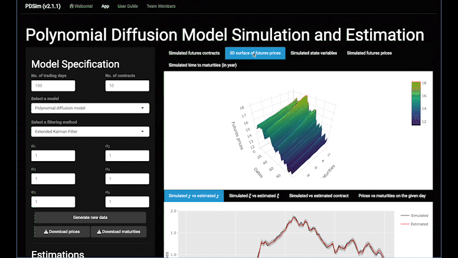

```{r, include = FALSE}
knitr::opts_chunk$set(
  collapse = TRUE,
  comment = "#>"
)
```

This is a simple tutorial of PDSim. This app generates futures price data from the polynomial diffusion model. Also, it gives state variables and contract estimations through Extended Kalman Filter (EKF) or Unscented Kalman Filter (UKF). The Schwartz and Smith's two-factor model is also provided for comparison. 

You can use the following codes to run the app:

```{r eval = FALSE}
devtools::install_github("peilun-he/PDSim")
PDSim::run_app()
```

Further details of the model are provided in the user guide, which can be found in the app or at: [https://github.com/peilun-he/PDSim](https://github.com/peilun-he/PDSim). 

## Specify state-space model 

PDSim allows users to select one model, the Schwartz-Smith two-factor model or polynomial diffusion model, to simulate futures data. If Schwartz-Smith two-factor model is selected, nothing else needs to be specified. However, if polynomial diffusion model is selected, then users have to specify a filtering method (EKF or UKF) and the polynomial coefficients $\alpha_1, \dots, \alpha_6$. The formal definitions of $\alpha_1, \dots, \alpha_6$ are available in the user guide, under the section "polynomial diffusion model".


## Enter parameters

After specifying the model, users have to enter the values of all parameters. No matter which model is selected, the interpretation of parameters does not change. To get the detailed interpretation of each parameter, please check the section "Schwartz-Smith Model" in the user guide. 


## Check simulated data

Available figures and tables of simulated data are as follows:

-   A time series plot of all futures prices.\
-   A 3-dimensional plot of the term structure of futures prices.\
-   A time series plot of simulated state variables $\chi_t$ and $\xi_t$.
-   A table of simulated futures prices (can be downloaded as a csv file).
-   A table of simulated time to maturities (can be downloaded as a csv file).



## Generate new sample realisation

Once all needed parameters and model specifications are entered, the data will generate automatically. However, if you want to generate another realisation with the same parameters, please click the "Generate new data" button.


## Perform filter for state-space model 

Available estimation plots are as follows:

-   Estimation of state variable $\chi_t$.
-   Estimation of state variable $\xi_t$.
-   Estimation of a particular contract (can be specified under the "Estimations").
-   Estimation of the term structure on a given day (can be specified under the "Estimations").


## Perform filter estimation accuracy residual analysis 

Available figures and tables of errors are as follows:

-   A table of root mean square error (RMSE), mean absolute error (MAE) and mean relative error (MRE) of each contract.
-   A time series of MRE.
-   A time series of MAE.
-   Boxplot of relative errors of each contract.
-   Boxplot of absolute errors of each contract.


